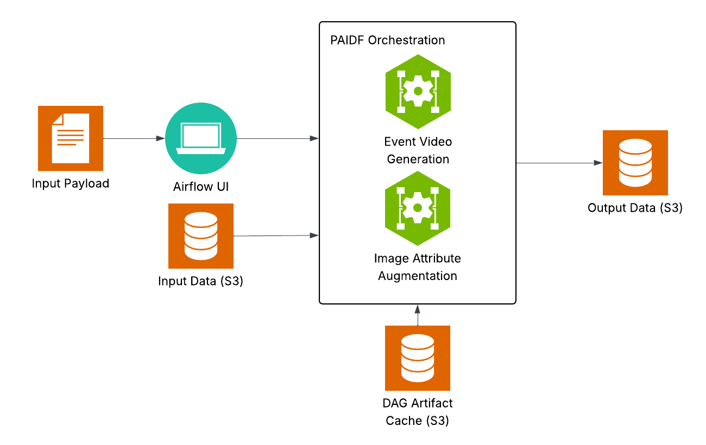

# PAIDF Orchestration

The Physical AI Data Factory (PAIDF) Orchestrator is an Airflow-based workflow orchestrator that runs on Kubernetes, syncs DAGs and plugins from S3, and can deploy GPU inference services and batch tasks in cluster. It is used to run a variety of Synthetic Data Generation (SDG) workflows to create annotated video and image data for physical AI use cases.

## What's Included

PAIDF Orchestration includes the following workflows, also referred to as DAGs (Directed Acyclic Graphs) within Airflow.

| DAG | What It Does |
|-----|--------------|
| **Image Attribute Augmentation** | The Image Attribute Augmentation pipeline augments existing person object crop datasets by generating controlled variations of clothing, colors, footwear, and other visible person attributes. |
| **Event Video Generation** | The Event Video Generation pipeline takes a seed image, and creates videos from it showing a controlled variation of event types, such as fires, falling, shoplifting, fighting and more. |

## Architecture

## Getting Started

To get started with PAIDF Orchestration, please visit the documentation in the [Getting Started Guide](docs/getting-started.md).

Other documentation for this repository may be found under the docs/ directory.

## Disclaimer

This product is provided as an Early Access release for evaluation, testing, and feedback purposes only. It may be incomplete, contain defects, change without notice, or produce unexpected results. Features, performance, documentation, APIs, and compatibility may differ from the final generally available release.

Use of this Early Access product is at your own risk. It should not be used in production environments or for business-critical workloads unless expressly approved by the provider. The provider makes no warranties, express or implied, regarding reliability, availability, accuracy, security, fitness for a particular purpose, or continued availability.

Feedback provided during the Early Access period may be used to improve the product. The provider may modify, suspend, or discontinue the Early Access program or any product functionality at any time.

## License and Contributions

The SDG Workflow is licensed under the Apache 2.0 license. This project is currently not accepting contributions.
